# Java Web Framework with Docker and AWS EC2 Deployment (AREP Workshop)

This project implements a lightweight web application framework in Java (without Spring), using reflection and annotations for route registration, with concurrent request handling and graceful shutdown. It includes Docker containerization, Docker Hub publishing flow, and AWS EC2 deployment steps.

## Getting Started

These instructions will get you a copy of the project up and running on your local machine for development and testing. The Maven module is inside AppWebServer_Docker, so all build and run commands must be executed from that folder.

### Prerequisites

What things you need to install the software and how to install them:

- Java 17+
- Maven 3.8+
- Docker Desktop (or Docker Engine)
- Git

```bash
java -version
mvn -version
docker --version
git --version
```

### Installing

A step by step series of examples that tell you how to get a development environment running.

Say what the step will be: clone the repository.

```bash
git clone https://github.com/Rogerrdz/Modularizaci-n_con_virtualizaci-n_e_Introducci-n_a_Docker_Arquitecturas_Empresariales.git
```

And repeat: enter the repository and then the Maven module.

```bash
cd Modularizaci-n_con_virtualizaci-n_e_Introducci-n_a_Docker_Arquitecturas_Empresariales
cd AppWebServer_Docker
```

And repeat: compile and install dependencies/artifacts.

```bash
mvn clean install
mvn compile
```

End with an example of getting some data out of the system or using it for a little demo.

```powershell
java -cp "target/classes;target/dependency/*" edu.escuelaing.arep.MicroSpringBoot2
```

Then open:

- http://localhost:8082/index.html
- http://localhost:8082/hello
- http://localhost:8082/hello?name=Roger

## Running the tests

Explain how to run the automated tests for this system:

```bash
cd AppWebServer_Docker
mvn test
```

### Break down into end to end tests

These tests validate framework behavior and endpoint responses (routes, query params, and route registry behavior).

```bash
mvn -Dtest=AppTest test
```

## Deployment

Add additional notes about how to deploy this on a live system.

Local Docker deployment:

```bash
cd AppWebServer_Docker
mvn clean package
docker build -t Rogerrdz/webframework-arep:latest .
docker run -d -p 42000:6000 --name web-aws Rogerrdz/webframework-arep:latest
docker ps
```

Docker Compose deployment:

```bash
cd AppWebServer_Docker
docker compose up -d
docker ps
```

Docker Hub publishing:

```bash
docker login
docker push Rogerrdz/webframework-arep:latest
```

AWS EC2 deployment notes:

```bash
sudo yum update -y
sudo yum install docker -y
sudo service docker start
sudo usermod -a -G docker ec2-user
```

After relogin:

```bash
docker login
docker run -d -p 42000:6000 --name web-aws Rogerrdz/webframework-arep:latest
docker ps
```

Remember to open inbound rule Custom TCP 42000 in the instance Security Group.

## Evidence

### Docker Build and Containers

Building Docker image:

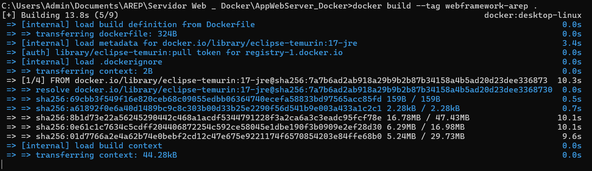

Images available locally:

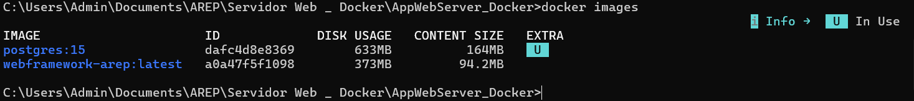

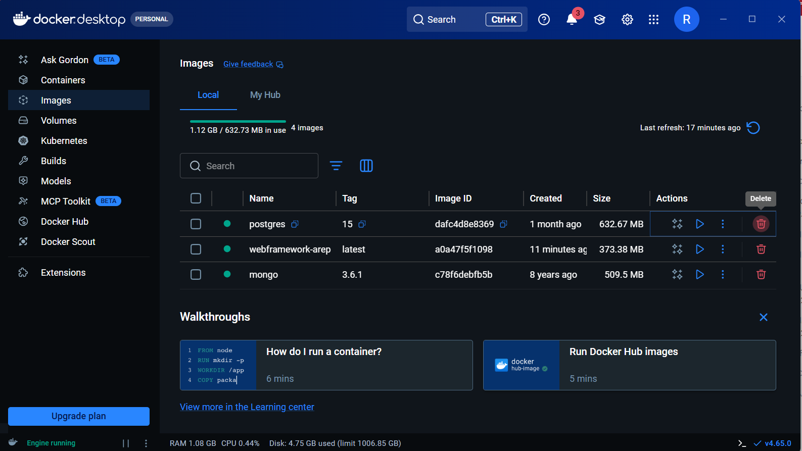

Running containers:

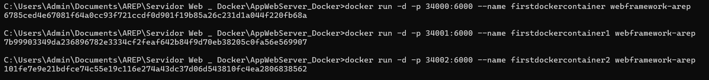

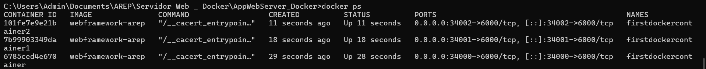

Browser test in local container deployment:

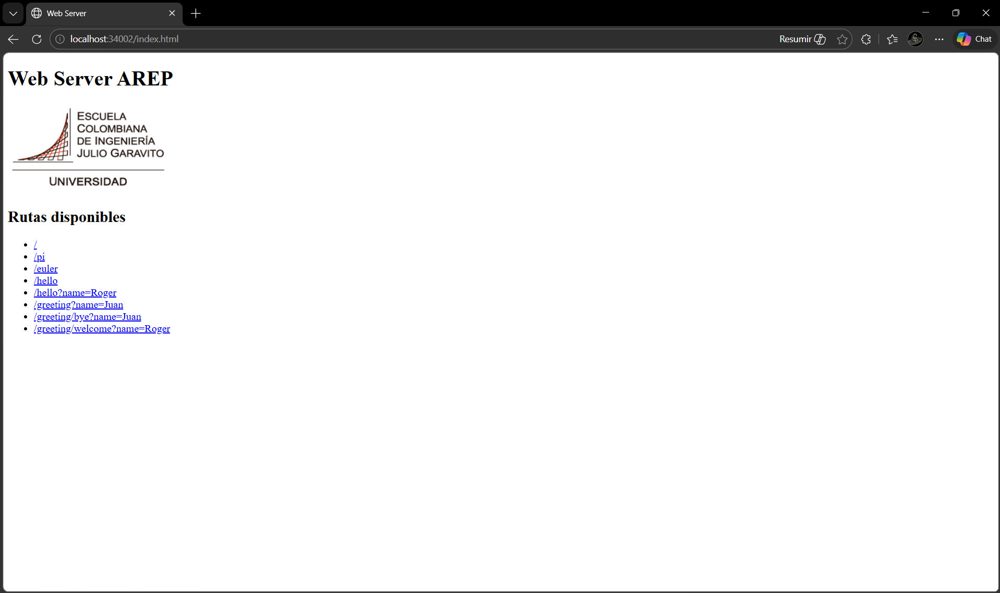

### Docker Compose Evidence

Compose execution with web and MongoDB:

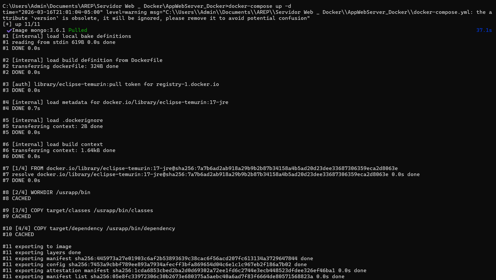

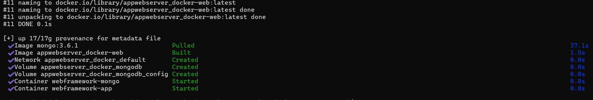

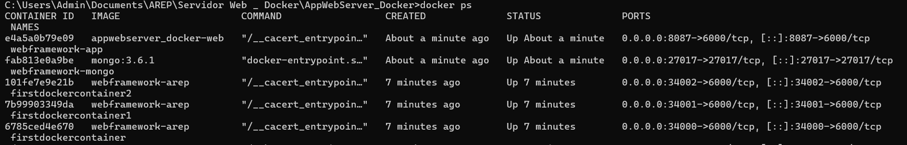

### Docker Hub Evidence

Docker Hub repository created:

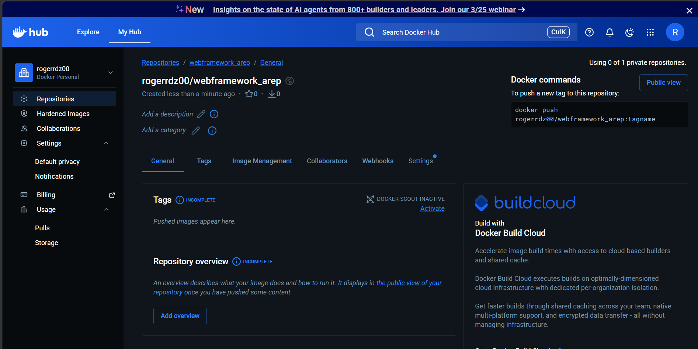

Tagged image for Docker Hub:

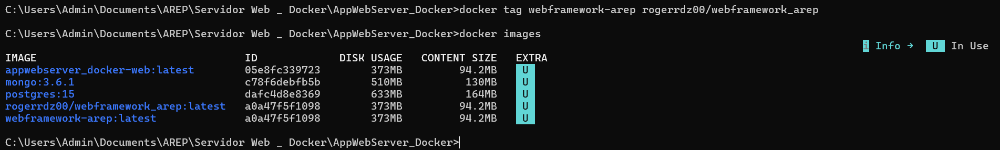

Push image to Docker Hub:

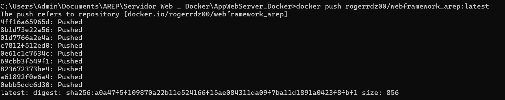

Published tags in Docker Hub:

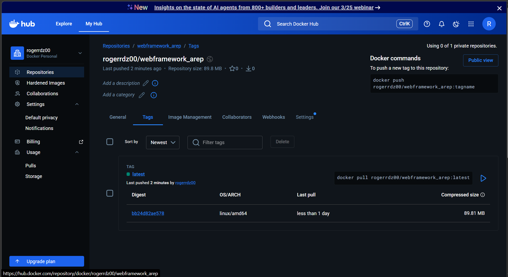

### AWS EC2 Evidence

EC2 instance created:

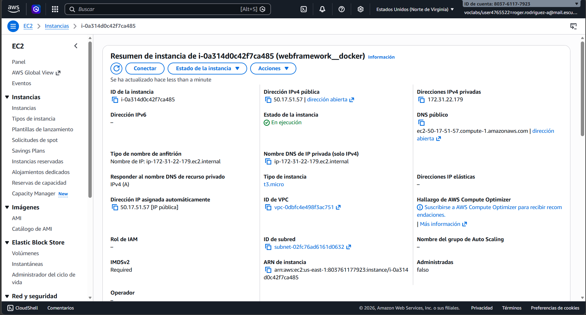

First connection to AWS instance:

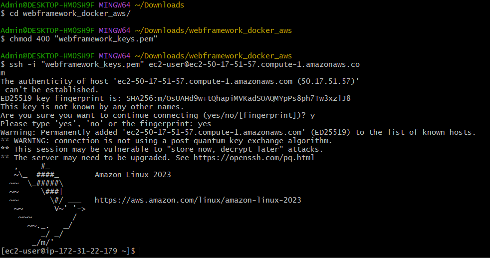

Container running in AWS from Docker Hub image:

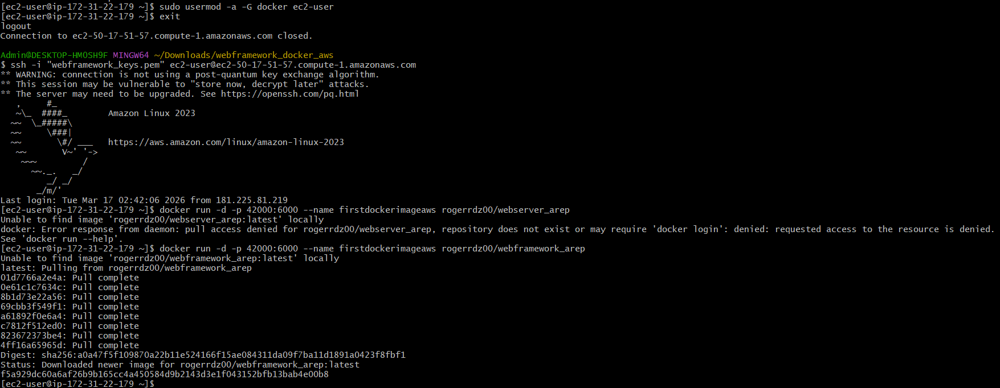

Public DNS endpoint working:

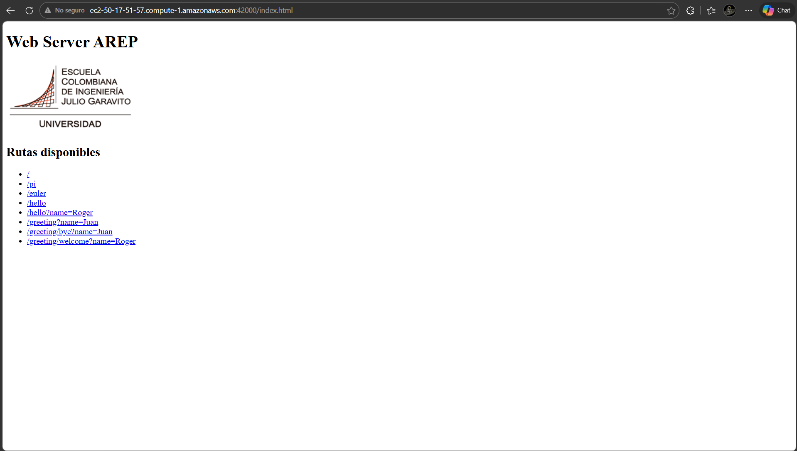

## Built With

* [Java 17](https://www.oracle.com/java/) - Programming language
* [Maven](https://maven.apache.org/) - Dependency Management
* [Docker](https://www.docker.com/) - Containerization
* [AWS EC2](https://aws.amazon.com/ec2/) - Cloud virtual machine deployment

## Contributing

Please open an issue to discuss major changes and submit your pull request with a clear description of the update.

## Versioning

We use [SemVer](http://semver.org/) for versioning. For the versions available, see the [tags on this repository](https://github.com/Rogerrdz/Modularizaci-n_con_virtualizaci-n_e_Introducci-n_a_Docker_Arquitecturas_Empresariales/tags).

## Authors

* **Roger Rodriguez** - *Initial work* - [Rogerrdz](https://github.com/Rogerrdz)

## Acknowledgments

* AREP course workshop guidelines
* Escuela Colombiana de Ingenieria
* Inspiration from annotation-driven web frameworks